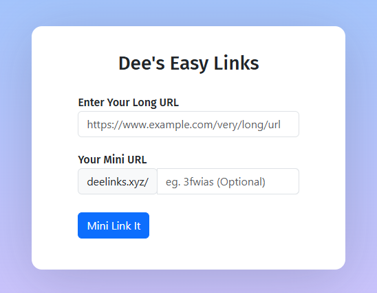
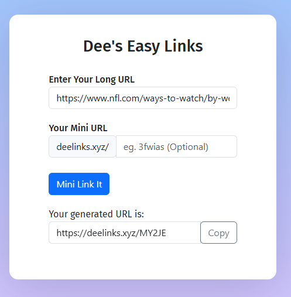
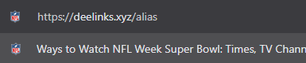

# Dee's Easy Links

A URL shortener app built with React, Flask, and Firebase.

React and Python Flask-based URL shortener implementing custom alias generation, Firebase Realtime Database storage, and redirect routing. Supports URL validation, short link creation, clipboard copy functionality, error handling, and Heroku deployment via a full-stack web application architecture.

## Features
- Shorten long URLs
- Optional custom aliases
- Copy generated links to clipboard
- URL and alias validation
- Firebase link storage
- Short link redirects

## Technologies
- JavaScript
- React
- Bootstrap
- Flask
- Firebase
- Python

## Installation
cd my-first-app
npm install

cd my-first-app/heroku-deploy
pip install -r requirements.txt

## Run
cd my-first-app
npm start

cd my-first-app/heroku-deploy
python wsgi.py

## How To Use
Enter a long URL, add an optional custom alias, and click Mini Link It.

Copy the generated short link and share it.

Open the short link to redirect to the original URL.

## Screenshots

### URL Shortener Form

### Generated Link

### Copy Link

### Redirect Page

